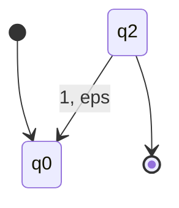

---
tags:
  - math
  - calculus
---
# Example
We have languages:
$L_{1} = \{ w \in \{ 0,1 \}^{*} : w \text{ starts with } 0 \}$
$L_{2} = \{ w \in \{ 0,1 \}^{*} : w \text{ contains } 1 \}$
We can construct [[Finite State Automata|FSA]] for both languages:
For $L_{1}$:
