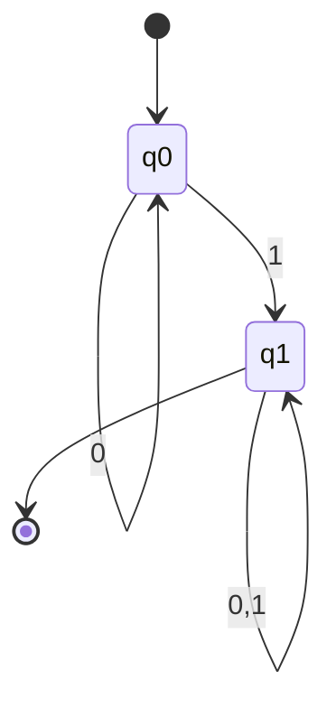
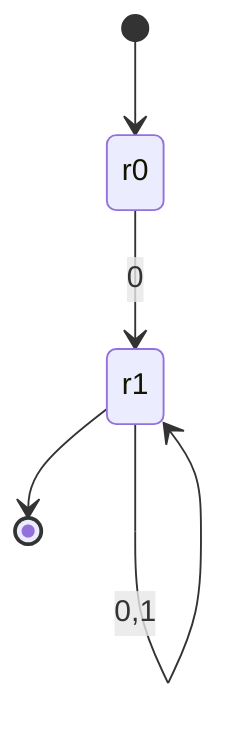
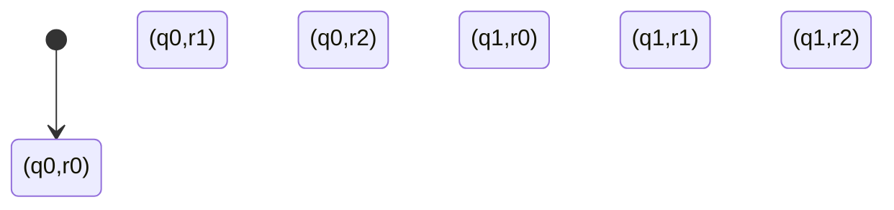
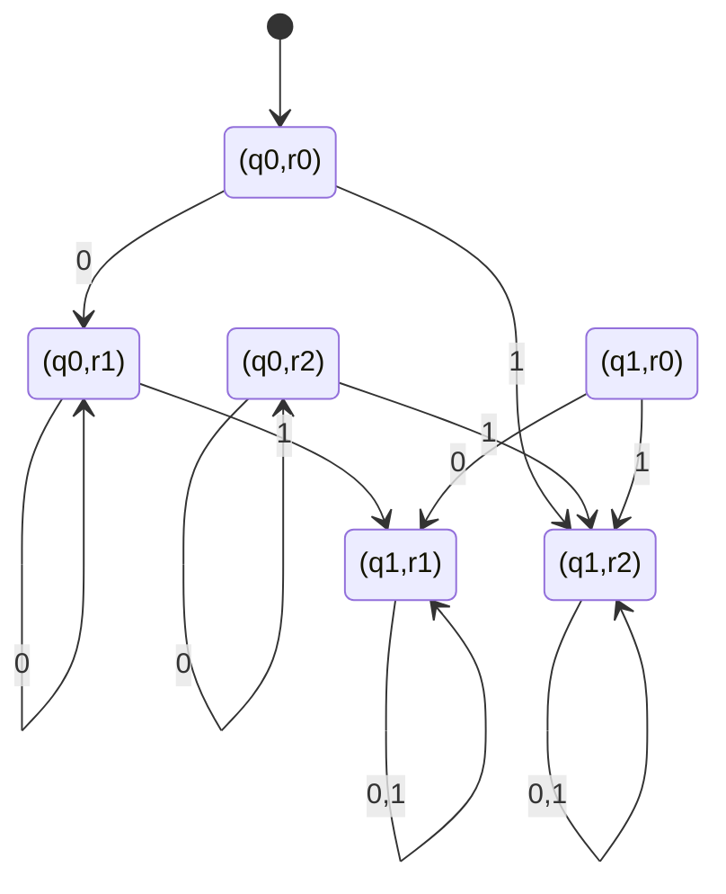
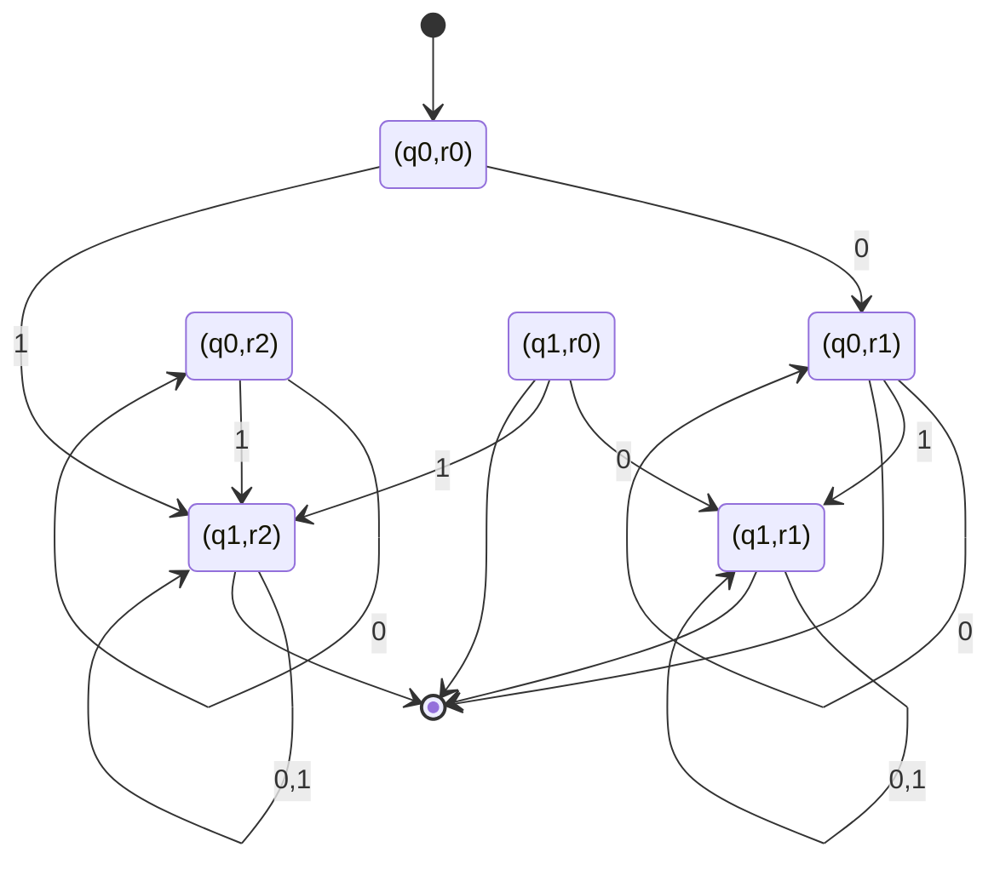

---
tags:
  - math
  - calculus
---
# Example
We have languages:
$L_{1} = \{ w \in \{ 0,1 \}^{*} : w \text{ starts with } 0 \}$
$L_{2} = \{ w \in \{ 0,1 \}^{*} : w \text{ contains } 1 \}$
We can construct [[Finite State Automata|FSA]] for both languages:
For $L_{1}$:

For $L_{2}$

We now construct the cartesian product consturction, create the sets of tuples of things

For each tuple, every item of the tuple points to the same item, for example if $q_{0} \to q_{1}$, then $(q_{0},*) \to (q_{1},*)$
So, lets construct the new FSA

Now, we make all the states that contain a terminal state, its own terminal state

