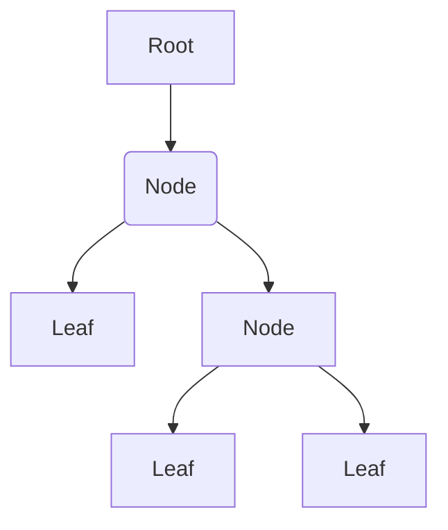

---
tags:
  - programming
  - algorithm
---
A data structure that involves:
- Nodes
- Links
It is a [[Programming/Graph|Graph]] that is [[Graph Connected|Connected]] without [[Graph Cycle|Cycles]]
# Structure
- Root node
- Children nodes of parent nodes
- Leaf nodes which have no children

# Properties
- [[Tree Height]]