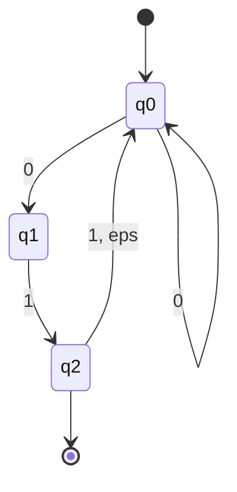

---
tags:
  - programming
  - math
---

With $\Sigma = \{ 0,1 \}$
# Describe the Language $\mathcal{L}(M)$
$\mathcal{L}(M) = \{ x \in \Sigma^{*} | x \text{ ends with 01} \wedge x \text{ starts with 0} \wedge \text{ 111 is not a substring of } x \}$
Note that regex $M = (0+01+011)^{*}01$
