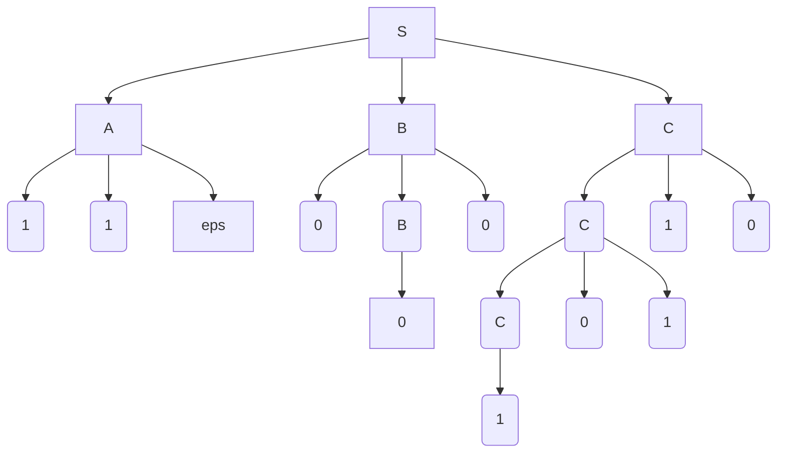

---
tags:
  - programming
  - math
---
For a given [[Context Free Grammar|CFG]], the parse tree can be generated from a root by every variable in its production.
# Example CFG
$$
\begin{align}
S \to ABC\\ 
A \to \epsilon \\
A \to 11A \\
B \to 0 \\
B \to 0B0 \\
C \to C10 \\
C \to C 01 \\
C \to 1
\end{align}
$$
# Tree

