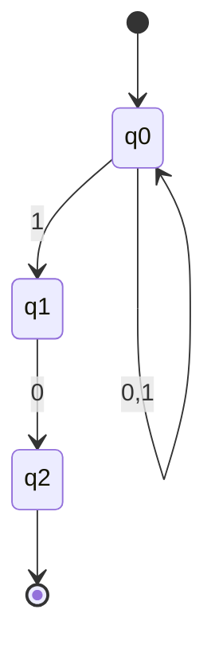

---
tags:
  - math
  - programming
---
# Example

# Table
We lay out the node and the transitions

|                             | 0             | 1                   |
| --------------------------- | ------------- | ------------------- |
| $\emptyset$                 | $\emptyset$   | $\emptyset$         |
| $\{ q_{0} \}$               | $\{ q_{0} \}$ | $\{ q_{0},q_{1} \}$ |
| $\{ q_{1} \}$               | $\{ q_{2} \}$ | $\emptyset$         |
| $\{ q_{2} \}$               | $\emptyset$   | $\emptyset$         |
| $\{ q_{0}, q_{1} \}$        |               |                     |
| $\{ q_{1}, q_{2} \}$     |               |                     |
| $\{ q_{0}, q_{2} \}$        |               |                     |
| $\{ q_{1}, q_{2}, q_{3} \}$ |               |                     |

