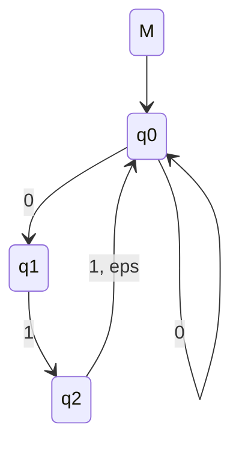
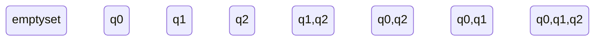
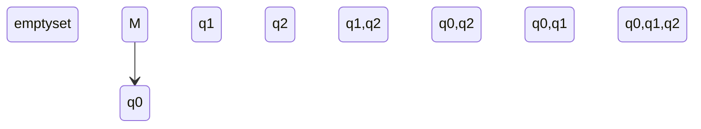

---
tags:
  - programming
  - math
---

# Conversion to [[Deterministic Finite Automaton|DFSA]] with [[Subset Construction]]

1. Write out all the possible sets of states

2. 
Then, denote the starting state

3. Then, for $q_{0}$, point to t