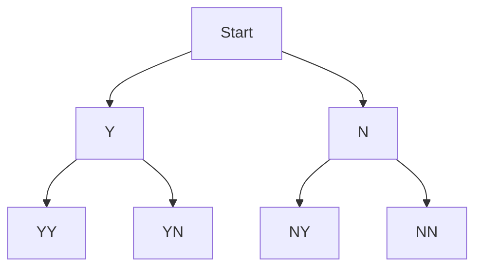
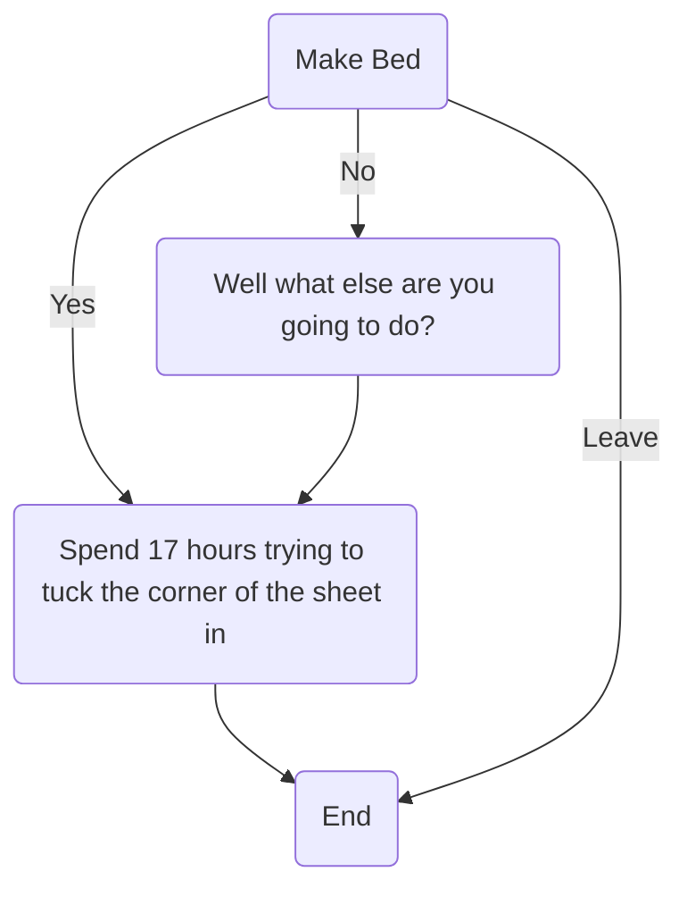
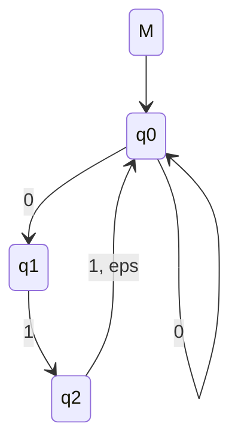

---
tags:
  - obsidian
  - javascript
---
Mermaid js is a javascript library that allows markdown generation of diagrams like flowcharts and trees.
Obsidian natively supports mermaid.js, so we can generate diagrams very easily using code blocks.
# Tree diagrams

# Flow charts

# [[Finite State Automata|FSA]]
